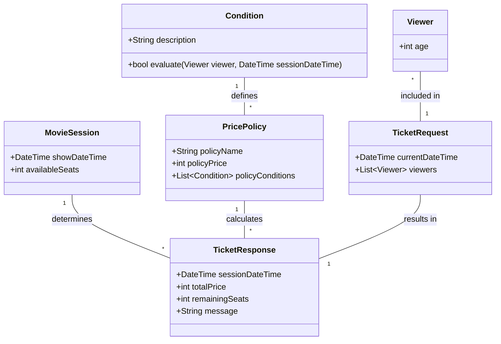
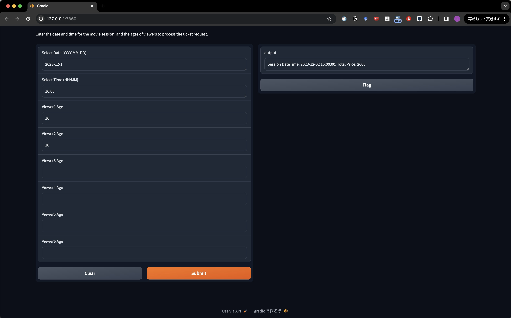
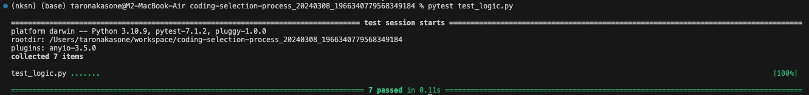

# 映画チケット料金計算システム

**システム概要**
このシステムは、クライアントから提供される`現在日時`と`参加者の情報`に基づき、最適な映画セッションとその料金を計算し、`最安値で観覧できる日時`と`料金`を返答する機能を持つ。料金計算は、年齢や映画の上映時間帯など、特定の条件に基づく割引ポリシーを考慮する。尚、システムは以下の要件を満たすように設計した。
- 最安値になる日時が複数存在する場合、最も早い日時のセッションのみを回答する。
- 適当な映画セッションが存在しない場合、その旨をクライアントに明確に通知する。

## 課題１
---
### 概念クラス図

以下、概念クラス図をmermaid記法を用いて、図示する。

### 各クラスにおける、入出力インターフェイス設計と意図
- MovieSession
    - 入力: なし（初期設定時に上映日時と席数を指定）
    - 出力: 映画の上映日時`datetime`とその残席数`availableSeats`
    - 意図: 映画の上映セッションを管理し、各セッションに対する基本情報（日時と残席数）を提供する。

- PricePolicy
    - 入力: 条件`List[Condition]`
    - 出力: 料金ポリシー（名前`policyName`、価格`policyPrice`、適用条件`policyConditions`）
    - 意図: さまざまな割引や料金設定を管理し、各ポリシーは特定の条件下で適用され、チケットの料金計算に使用される。

- Condition
    - 入力:Viewerクラスのインスタンス、セッション時間`DateTime`
    - 出力:条件が満たされるかどうかの真偽値（TrueまたはFalse）
    - 意図: 料金ポリシーが適用されるかどうかを判断するための具体的な条件を評価をこのクラスが担う。例えば、「18歳未満」や「レイトショー」などの条件がこれに該当する。条件をオブジェクトとしてモデル化することで、新しい割引ポリシーなどを容易に追加し、システムの拡張性と保守性向上を図る。

- Viewer
    - 入力: 年齢`age`
    - 出力：なし
    - 意図: 映画観覧者（顧客）の属性を表す。現在の設計では、年齢のみを保持し、料金計算の際の条件判定に用いる。新しい割引ポリシーなどの追加に応じて、属性（例えば、性別・住民情報など）を追加する。

- TicketRequest
    - 入力: 現在日時`currentDateTime`、参加者リスト`List[Viewer]`
    - 出力: リクエストとしてシステムに送信される
    - 意図: このクラスはシステムに対するリクエストを表す。クライアントから提供される情報に基づいて、最適な映画セッションと料金を計算するための入力データを提供する。

- TicketResponse
    - 入力: なし
    - 出力: 選択された映画セッションの日時`sessionDateTime`、総料金`totalPrice`、選択されたセッションの残り席数`remainingSeats`、メッセージ`message`
    - 意図: チケット購入リクエストに対するシステムの回答を表す。計算された最適な映画セッションと総料金、およびその他の関連情報（残席数やエラーメッセージなど）をクライアントに提供する。


## 課題２
---
バックエンドを志望し、PythonとGradioを使用してWeb APIを構築する。

**モジュール設計**
- models.py: システムのデータモデル（MovieSession, PricePolicy, Viewer, Ticket）を定義するモジュール。
- database.py: システムのデータ（上映セッション、料金ポリシー、チケット）を管理するための仮想データベース機能を提供するモジュール。実際のデータベースではなく、デモンストレーションのための簡易的なインメモリデータストアとして機能する。
- logic.py: チケットの料金を計算するロジックを含むモジュール。利用可能なPricePolicyに基づき、最適な料金を計算する。
- main.py: Gradioを使用してAPIサーバーを構築し、クライアントからのリクエストを処理するエントリポイント。


### localで動作確認可能なソースコード
`./main.py` が動作確認可能なdemoコードである。

以下のコマンドを実行することで、デモ実行できる。
```bash
$ python main.py
```

本デモでは、Webアプリケーションを簡易的に作り、動作確認を行うという観点からPythonのライブラリーであるGradioを用いた。

### 検証用テストコード

`src/test_logic.py` がテストコードである。

以下のコマンドを実行することで、テスト実行できる。
```bash
$ pytest src/test_logic.py
```


